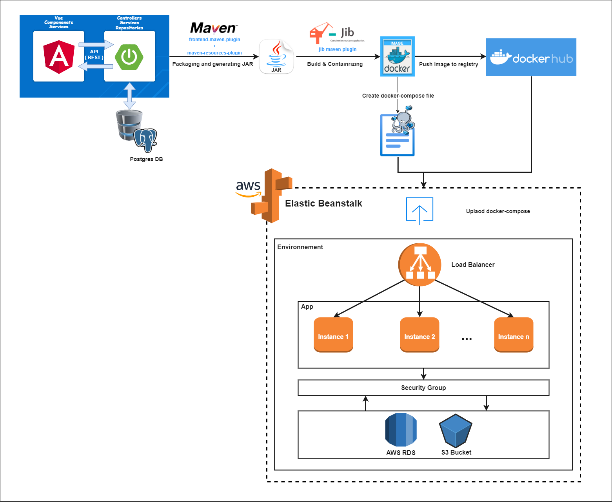

# Tasks Planner ✨

<p align="center">
   
</p>

<p align="center">
   
   
   
   
   
   
</p>

# Overview

- Tasks planner is a minimalist collaborative app for planning and managing your tasks with the team and get notifications through discord.
- Once the task is created by the super admin (project manager), the application notifies affected users that a new task has been created using Discord Webhooks.
- This project is a web app developed with spring Boot (backend) & Angular (frontend).
- The workflow is managed by Git Actions  CI/CD in order to automate deployment into AWS (AWS Elastic Beanstalk, RDS and AWS S3).
- [new feature upcoming](#upcoming-features)

# Application live
- Super Admin account : nanodev/password123
- User acccount : miliariadnane/password123
> [Link to the application](http://tasksplanner-env.eba-pkikrhha.us-east-1.elasticbeanstalk.com/)

# Technologies
<!-- Spring -->
<a href="https://spring.io/" target="_blank">

</a>
<!-- Hibernate -->
<a href="https://hibernate.org/" target="_blank">

</a>
<!-- Docker -->
<a href="https://www.docker.com/" target="_blank">

</a>
<!-- Angular -->
<a href="https://angular.io/" target="_blank">

</a>
<!-- Junit5 -->
<a href="https://junit.org/junit5/" target="_blank">

</a>
<!-- postgres -->
<a href="https://www.postgresql.org/" target="_blank">

</a>
<!-- aws -->
<a href="https://aws.amazon.com/" target="_blank">

</a>
<!-- discord -->
<a href="https://discord.com/" target="_blank">

</a>
<br><br>

- Backend:
    - Spring Frameworks :
      - Spring Boot 
      - Spring Data Jpa 
      - Spring MVC
      - Spring Security / JWT (for new feature)
    - Hibernate 
    - Docker 
    - JIB (build docker image tool)
    - frontend-maven-plugin library (build angular frontend)
    - Junit5 (unit / integration tests)
    - Mockito 
  
- Frontend:
    - Angular 

- Database:
    - Postgres 

- CI/CD:
    - GitHub Actions

- Cloud:
    - AWS Elastic Beanstalk 
    - AWS RDS

- Webhooks:
    - Discord 
 
# Process Diagram 
<p align="center">
   
</p>

# Upcoming features

- [x] Build & Deploy workflows using Git Actions.
- [x] Add users backend endpoints & UI.
- [x] Add security layer (Spring security + JWT).
- [x] Store user image in aws using s3 bucket.
- [x] Notify affected users when a task is created via discord.
- [x] Add monitoring dashboard (Spring Actuator).
- [x] Reset password and mailing service by aws.
- [ ] Notify admin via discord about deployment progress.
- [ ] Complete unit and integration tests.

# ScreenShots

* Tasks List :
<p align="center">
  
</p>

* Add new Task (Form) :
<p align="center">
  
</p>

* Users List :
<p align="center">
  
</p>

* Discord Notification :
<p align="center">
  
</p>

* Reset user password :
<p align="center">
  
</p>

* Monitoring Dashboard :
<p align="center">
  
</p>

# Some commands to run the application

### Build image and push it to dockerhub (configure jib on pom.xml)

```
mvn clean install jib:build -Djib.to.image=miliariadnane/tasks-planner:v4 -Djib.to.auth.username=miliariadnane -Djib.to.auth.password=yourpassword
```

### Create database via command line (create db first on AWS RDS)

1. connect to the database
```
docker run -it --rm postgres:alpine psql -h aa33y2ufc6m1bo.cllttiutrcg0.us-east-1.rds.amazonaws.com -U nanodev -d postgres
```

2. create database
```
create database tasksplanner;   
```
